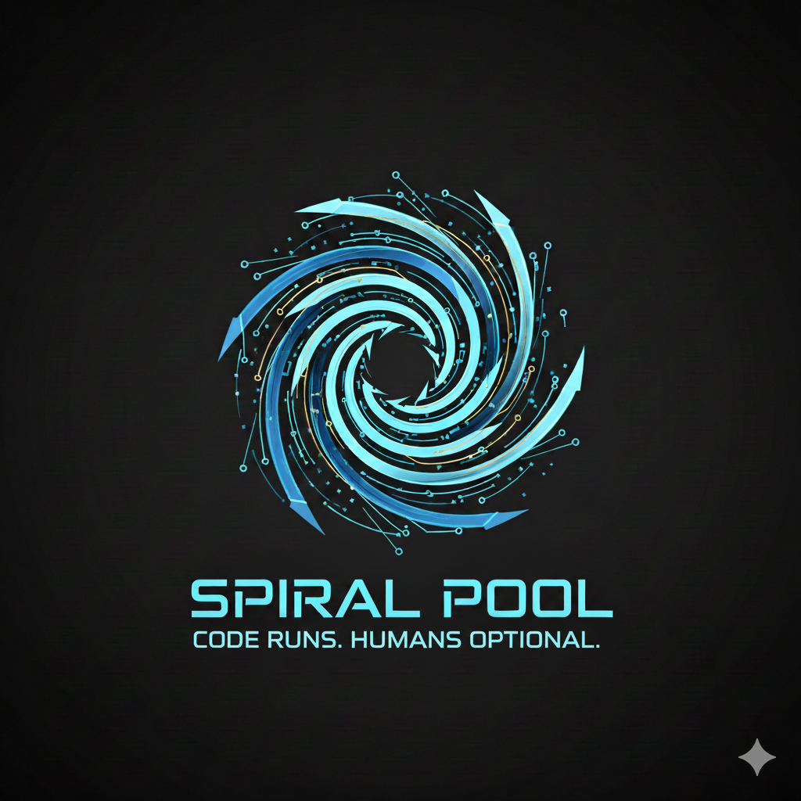

# Spiral Pool — Self-Hosted Solo Mining Pool Software

<p align="center">
  
</p>

<p align="center">
  <strong>Self-Hosted Bitcoin &amp; Altcoin Mining Pool Software &mdash; Stratum V1/V2/TLS, SHA-256d &amp; Scrypt</strong><br>
  <em>Phi Hash Reactor V2.1.0 </em>
</p>

<p align="center">
  Free and Open Source &bull; BSD-3-Clause &bull; Non-Custodial &bull; Solo Mining &bull; Proof-of-Work
</p>

<p align="center">
  <strong>Contact:</strong> spiralpool@proton.me &bull; Discord: Fibonacci#1618
</p>

<p align="center">
  <a href="LICENSE"></a>
  <a href="https://github.com/SpiralPool/Spiral-Pool/releases"></a>
  <a href="https://github.com/SpiralPool/Spiral-Pool/stargazers"></a>
  <a href="https://x.com/SpiralMiner"></a>
</p>

---

> **NOTICE**: This software is provided "AS IS" without warranty. It has NOT been audited by third-party security professionals. No security guarantee is made. Operators are solely responsible for compliance with all applicable laws, their own security assessment, and all consequences of operating this software. See [LICENSE](LICENSE), [TERMS.md](TERMS.md), [WARNINGS.md](WARNINGS.md), and [SECURITY.md](SECURITY.md).

---

## What Is Spiral Pool?

Spiral Pool is **free, open-source, self-hosted Stratum mining pool software** for proof-of-work cryptocurrencies. Install it on your own bare-metal server, connect your ASIC miners directly, and block rewards go straight to your wallet. No custodians. No middlemen. No cloud.

Block rewards are embedded directly in the coinbase transaction paying the **miner's own wallet address**. The intended fund flow is: **Blockchain &rarr; Coinbase Transaction &rarr; Miner's Wallet.** There is no pool wallet, no intermediate balance, no fees, and no withdrawal process &mdash; the software is designed to never hold, route, or access funds at any point in the payment path.

At its core is the **Spiral Router** &mdash; a miner classification engine that identifies miners via 47 verified user-agent patterns at connection time and maps each to one of 15 SHA-256d or 8 Scrypt difficulty profiles before a single share is submitted. Paired with a **lock-free vardiff engine** using per-session atomic state, asymmetric ramp limits (4&times; up / 0.75&times; down), and a 50% variance floor, difficulty spirals toward equilibrium rather than oscillating around a target.

14 coins. 2 algorithms. 6 merge-mining pairs. One binary.

### No Tiers. No Licensing. No Strings.

Spiral Pool is released under the BSD-3-Clause license with no commercial licensing tiers, no premium editions, no paywalls, no freemium upsells, no subscription gates, no "community vs. enterprise" split, and no feature locks of any kind. Every capability ships in a single codebase available to every operator equally.

The software collects **no telemetry, no analytics, no usage metrics, and no phone-home data** &mdash; not optionally, not anonymously, not ever. There are no embedded tracking endpoints and no remote feature flags. The dashboard loads fonts and JavaScript libraries from third-party CDNs by default (see [PRIVACY.md](PRIVACY.md) for details and self-hosting guidance); aside from these standard web resources, the software makes no outbound connections to any third party on behalf of the operator.

There is no token, no chain, no governance layer, and no protocol-level fee extraction. Spiral Pool is infrastructure software, not a platform.

This is pure free and open-source software. Fork it, audit it, modify it, redistribute it. The code speaks for itself.

> **SINGLE-OPERATOR NOTICE:** Spiral Pool is designed for **one operator running their own miners**. One wallet address per coin is set at install time &mdash; **all block rewards go to that address**, regardless of which miner found the block. If you allow others to mine on your pool, you must inform them that their hashrate contributes to your wallet, not their own. See [WARNINGS.md](WARNINGS.md) and [TERMS.md Section 5E](TERMS.md).

---

## Key Features

| Feature | Details |
|---------|---------|
| **High availability** | VIP failover, Patroni replication, blockchain rsync, advisory lock payment fencing |
| **Lock-free vardiff** | Per-session atomic state, asymmetric limits (4&times; up / 0.75&times; down), 50% variance floor |
| **Merge mining** | 6 AuxPoW pairs across BTC and LTC parent chains |
| **Multi-algorithm** | SHA-256d and Scrypt with dedicated difficulty profiles per algorithm |
| **Non-custodial solo payout** | Block reward embedded in coinbase tx &rarr; miner's wallet. No pool wallet, no custody |
| **Prometheus metrics** | Per-session observability with worker-level labels |
| **Pruned node support** | Optional per-coin blockchain pruning (5 GB cap). Saves 95%+ disk &mdash; BTC 600 GB&rarr;5 GB, DGB 60 GB&rarr;5 GB. Enable at install time or via `spiralctl coin prune <TICKER>` |
| **Runtime tuning** | Live operator control via `spiralctl` CLI |
| **Share pipeline** | Lock-free ring buffer (1M, MPSC) &rarr; WAL &rarr; PostgreSQL COPY batch insert |
| **SimpleSwap alerts** | Optional sat-surge alerts with pre-filled [SimpleSwap.io](https://simpleswap.io) link. Operator-initiated only &mdash; no automatic swaps. See [TERMS.md 5D](TERMS.md) |
| **Spiral Dash** | Interactive hashrate/analytics charts (15M&ndash;30D), fleet power &amp; efficiency, earnings calculator, block finder history, CSV/JSON export. Per-firmware miner controls (AxeOS, Avalon, Vnish, ePIC, LuxOS). Worker groups &amp; tags. Avalon time-based power schedules. Service control, log viewer, system updates. 23 built-in themes (port 1618) |
| **Spiral Router** | Classifies miners at connection time via 47 verified user-agent patterns across 15 SHA-256d and 8 Scrypt difficulty profiles |
| **Spiral Sentinel** | Device discovery, BraiinsOS/Vnish auto-scan, stratum URL &amp; wallet mismatch detection, health checks, temp/disk/hashrate alerts, block notifications, dry streak &amp; difficulty change detection, mempool congestion. Discord, Telegram, XMPP, ntfy, SMTP, and generic webhooks |
| **Stratum V1 + V2 + TLS** | Multi-port per coin; Noise Protocol encryption for V2 |
| **Multi-coin smart port** | **⚠️ Experimental** &mdash; Single stratum port (16180) that mines multiple SHA-256d coins on a 24-hour weighted schedule. Automatic rotation, per-session tracking, failover. See [MULTI_COIN_PORT.md](docs/reference/MULTI_COIN_PORT.md) |
| **Test suite** | 3,500+ unit, integration, chaos, and fuzz tests including 10 numbered chaos suites |

---

## Compatible Hardware

Spiral Pool is designed to work with Stratum V1-compatible ASIC miners. The Spiral Router classifies hardware at connection time using 47 verified user-agent patterns.

**SHA-256d** &mdash; Antminer S9/S17/S19/S19 Pro/S21/S21 Pro, Whatsminer M20S/M30S/M50S/M60S, Avalon A1246/A1346/A1366, BitAxe Gamma/Ultra/Max, iBeLink BM-S1 Max, FutureBit Apollo BTC, NerdMiner, NM Miner, NerdAxe, NerdQAxe, Compac F, LuckyMiner

**Scrypt** &mdash; Antminer L3+/L7/L9, Whatsminer M31S, Innosilicon A6+ LTC Master, FutureBit Apollo LTC

**Low-power / DIY / Lottery** &mdash; BitAxe, NerdMiner, NM Miner, NerdAxe, NerdQAxe, Compac F, LuckyMiner, and any ESP32-based device &mdash; any Stratum V1-compatible hardware regardless of hash power

> Unknown hardware falls back to a safe default profile automatically.

---

## Supported Coins

### SHA-256d

| Coin | Symbol | Block Time | Merge-Mined With |
|------|--------|------------|------------------|
| Bitcoin | BTC | 10 min | Parent chain |
| Bitcoin Cash | BCH | 10 min | &mdash; |
| DigiByte | DGB | 15 sec | &mdash; |
| Bitcoin II | BC2 | 10 min | &mdash; |
| Namecoin | NMC | 10 min | BTC (AuxPoW, chain ID 1) |
| Syscoin | SYS | 2.5 min | BTC (AuxPoW, chain ID 16) &mdash; merge-mining only |
| Myriad | XMY | 1 min | BTC (AuxPoW, chain ID 90) |
| Fractal Bitcoin | FBTC | 30 sec | BTC (AuxPoW, chain ID 8228) |
| Q-BitX | QBX | 2.5 min | &mdash; |

### Scrypt

| Coin | Symbol | Block Time | Merge-Mined With |
|------|--------|------------|------------------|
| Litecoin | LTC | 2.5 min | Parent chain |
| Dogecoin | DOGE | 1 min | LTC (AuxPoW, chain ID 98) |
| DigiByte-Scrypt | DGB-SCRYPT | 15 sec | &mdash; |
| PepeCoin | PEP | 1 min | LTC (AuxPoW, chain ID 63) |
| Catcoin | CAT | 10 min | &mdash; |

> Syscoin (SYS) is merge-mining only &mdash; requires a BTC parent chain.

### Merge Mining Topology

```
BTC ──┬── NMC  (Namecoin)         LTC ──┬── DOGE (Dogecoin)
      ├── SYS  (Syscoin)                └── PEP  (PepeCoin)
      ├── XMY  (Myriad)
      └── FBTC (Fractal Bitcoin)

QBX (standalone — no merge mining)
```

---

## Architecture

```
                       ┌────────────────────────────────────────────────┐
  Miners               │              Spiral Pool Node                  │
  ┌──────┐  Stratum    │                                                │
  │BitAxe├──V1/V2/TLS─►│  Spiral Router ──► VarDiff Engine              │
  ├──────┤             │       │                  │                     │
  │ S21  ├──►          │       ▼                  ▼                     │
  ├──────┤             │  Share Validation ──► Ring Buffer (1M)         │
  │ESP32 ├──►          │       │                  │                     │
  └──────┘             │       ▼                  ▼                     │
                       │  Block Submit        WAL ──► PostgreSQL        │
                       │       │                                        │
                       │       ▼                                        │
                       │  Coin Daemons (RPC + ZMQ)   Prometheus :9100   │
                       │                                                │
                       │  Sentinel ◄──► Dashboard :1618 ◄──► API :4000  │
                       └────────────────────────────────────────────────┘
```

---

## Who This Is For

- **Solo miners** running dedicated ASIC hardware who want full sovereignty over their pool infrastructure
- **Home miners** with diverse hardware &mdash; ESP32 lottery miners, BitAxe, Avalon, Antminer &mdash; all on one pool
- **Operators** who need complete vardiff visibility and runtime tuning

**Not for:** managed pool services, proportional payout splitting (this is solo-only), or operators without Linux sysadmin experience. Cloud/VPS is technically supported but **not recommended** &mdash; see [WARNINGS.md](WARNINGS.md) and [CLOUD_OPERATIONS.md](docs/setup/CLOUD_OPERATIONS.md).

---

## Platform Support

| Platform | Status | Notes |
|----------|--------|-------|
| **Ubuntu 24.04.x LTS** | **Primary** | Native install. Docker available. **x86_64 only.** |
| **Windows 11 &mdash; Docker Desktop** | **Experimental** | Automated single-coin setup via `install-windows.ps1`. See [Windows Guide](docs/setup/WINDOWS_GUIDE.md). |
| **Windows 11 &mdash; WSL2 Native** | **Experimental** | Full feature set via `install.sh` inside WSL2. Requires [port forwarding](scripts/windows/start-wsl2-proxy.bat) and [shutdown hook](scripts/windows/wsl2-shutdown-hook.ps1). See [Windows Guide](docs/setup/WINDOWS_GUIDE.md). |
| **ARM / Raspberry Pi** | **Not Tested** | All binaries target x86_64. ARM may not work. See [WARNINGS.md](WARNINGS.md). |

---

## Quick Start

> **New to servers?** See the [Server Preparation Guide](docs/setup/OPERATIONS.md#0-server-preparation--ubuntu-2404x-lts-noble-numbat) first.

### Prerequisites

- Ubuntu Server 24.04.x LTS (minimized), x86_64
- 10 GB RAM minimum (16 GB recommended)
- 150 GB SSD minimum (Bitcoin: ~600 GB &mdash; see [Storage Requirements](docs/setup/OPERATIONS.md#2-storage-requirements))
- IPv4 network (IPv6 not supported)
- Bare metal or self-hosted VM strongly recommended

```bash
sudo apt-get -y update && sudo apt-get -y upgrade
sudo apt-get -y install git
```

### Install

**Option A &mdash; Git clone:**

```bash
git clone --depth 1 https://github.com/SpiralPool/Spiral-Pool.git
cd Spiral-Pool && ./install.sh
```

**Option B &mdash; ZIP archive:**

```bash
unzip Spiral-Pool.zip
cd Spiral-Pool && ./install.sh
```

The installer automates the full stack: coin daemons, PostgreSQL, Go toolchain, stratum compilation, TLS certificates, systemd services, firewall rules, and monitoring. Checkpoint resume means a failed install can be re-run safely.

**Option C &mdash; Docker:**

```bash
cd docker && cp .env.example .env
# Edit .env — set POOL_COIN and POOL_ADDRESS (or POOL_MODE=multi for multi-coin)
./generate-secrets.sh
docker compose --profile dgb up -d
```

Docker supports V1 + V2 Stratum (plain, TLS, Noise), all 14 coins, multi-coin mode, and merge mining. For HA with VIP failover, use native installation. See [DOCKER_GUIDE.md](docs/setup/DOCKER_GUIDE.md).

### Connect Your Miners

```
URL:      stratum+tcp://YOUR_SERVER_IP:PORT
Worker:   YOUR_WALLET_ADDRESS.worker_name
Password: x
```

See [REFERENCE.md](docs/reference/REFERENCE.md) for all coin-specific stratum ports.

### Notifications

Spiral Sentinel supports real-time alerts via **Discord**, **Telegram**, **XMPP/Jabber**, **ntfy**, **SMTP email**, and **generic webhooks** (HTTP POST to any URL &mdash; Zapier, Home Assistant, IFTTT, PagerDuty, n8n) for block discoveries, miner status changes, temperature warnings, and hashrate reports. Configure during installation or in `~/.spiralsentinel/config.json`. See [SENTINEL.md](docs/reference/SENTINEL.md) for setup details.

---

## Documentation

| Document | Description |
|----------|-------------|
| [OPERATIONS.md](docs/setup/OPERATIONS.md) | Installation, configuration, monitoring, HA, upgrading, troubleshooting |
| [UPGRADE_GUIDE.md](docs/setup/UPGRADE_GUIDE.md) | v1.0 &rarr; v2.0.0 upgrade guide |
| [CLOUD_OPERATIONS.md](docs/setup/CLOUD_OPERATIONS.md) | Cloud/VPS deployment hardening and security |
| [DOCKER_GUIDE.md](docs/setup/DOCKER_GUIDE.md) | Docker &amp; WSL2 deployment |
| [WINDOWS_GUIDE.md](docs/setup/WINDOWS_GUIDE.md) | Windows installation &mdash; Docker Desktop vs WSL2 Native |
| [ARCHITECTURE.md](docs/architecture/ARCHITECTURE.md) | Spiral Router, vardiff engine, share pipeline, database schema, HA |
| [SECURITY_MODEL.md](docs/architecture/SECURITY_MODEL.md) | FSM enforcement, JSON hardening, rate limiting, TLS, payment fencing |
| [REFERENCE.md](docs/reference/REFERENCE.md) | Ports, CLI commands, API endpoints, miner classes, config fields |
| [spiralctl-reference.md](docs/reference/spiralctl-reference.md) | Complete spiralctl CLI reference |
| [SENTINEL.md](docs/reference/SENTINEL.md) | Sentinel configuration &mdash; all keys, defaults, examples |
| [DASHBOARD.md](docs/reference/DASHBOARD.md) | Dashboard setup, themes, device types |
| [MINER_SUPPORT.md](docs/reference/MINER_SUPPORT.md) | Hardware support: device APIs, auto-detection, monitoring |
| [EXTERNAL_ACCESS.md](docs/reference/EXTERNAL_ACCESS.md) | Port forwarding, Cloudflare tunnels, hashrate marketplace |
| [TESTING.md](docs/development/TESTING.md) | 3,500+ tests: unit, integration, chaos, fuzz suites |
| [COIN_ONBOARDING_SPEC.md](docs/development/COIN_ONBOARDING_SPEC.md) | Adding new coin support |

---

## Community

- [@SpiralMiner](https://x.com/SpiralMiner) &mdash; Release announcements and project updates
- [GitHub Issues](https://github.com/SpiralPool/Spiral-Pool/issues) &mdash; Bug reports and feature requests
- [GitHub Discussions](https://github.com/SpiralPool/Spiral-Pool/discussions) &mdash; Questions and community discussion

---

## Acknowledgments

Spiral Pool is community-driven free and open-source software. Bug reports, feature suggestions, and feedback from the community are what shape this project &mdash; every report helps make the software better for all operators. If you've found an issue or have an idea, open a [GitHub Issue](https://github.com/SpiralPool/Spiral-Pool/issues) or reach out via email at spiralpool@proton.me. All contributions are greatly appreciated.

This implementation follows the [Stratum V2 Specification](https://github.com/stratum-mining/sv2-spec) for V2 protocol support and uses the [Noise Protocol Framework](https://noiseprotocol.org/) for encryption. Block template handling follows BIP 22/23 specifications.

---

## Donations

Spiral Pool is **free, open-source software** &mdash; fully yours to run, modify, and control. BSD-3-Clause. Donations are appreciated but never expected.

| Coin | Address |
|------|---------|
| Bitcoin (BTC) | `bc1qnmps0ga6ms3lsd0f6zsm94mq44slgnac8w5fjj` |
| Bitcoin Cash (BCH) | `bitcoincash:qp2wmc5u0ehfglf2n7prsyc97l4hyetu8su8k76ztq` |
| DigiByte (DGB) | `DAjLRZ4ZsbUcLFFtf3GGbEKWmakNTLh6aq` |

> Donations are voluntary, unconditional gifts received by individual maintainers in their personal capacity. No services, features, or support are provided in exchange. Cryptocurrency transactions are irreversible. This is not financial, legal, or tax advice.

---

## Changelog

See [CHANGELOG.md](CHANGELOG.md) for the full version history, including all features and bug fixes.

---

## Legal

**THIS SOFTWARE IS PROVIDED "AS IS" WITHOUT WARRANTY OF ANY KIND.** This is software, not a service. Use at your own risk. You are solely responsible for legal compliance, security, and all consequences of operation. See the documents below for the complete legal framework.

| Document | Description |
|----------|-------------|
| [LICENSE](LICENSE) | BSD-3-Clause License |
| [TERMS.md](TERMS.md) | Terms of Use (arbitration, governing law, class action waiver) |
| [WARNINGS.md](WARNINGS.md) | Specific Hazard Warnings (financial, security, legal, operational) |
| [PRIVACY.md](PRIVACY.md) | Privacy Notice (GDPR/CCPA/PIPEDA) |
| [SECURITY.md](SECURITY.md) | Security Policy, Incident Response |
| [EXPORT.md](EXPORT.md) | Export Control and Sanctions Notice |
| [TRADEMARKS.md](TRADEMARKS.md) | Third-Party Trademark Notice |
| [NOSEC.md](NOSEC.md) | Security Architecture Decisions |
| [CONTRIBUTING.md](CONTRIBUTING.md) | Contribution Guidelines (DCO, irrevocable license grant) |

All product names, logos, and brands are property of their respective owners. See [TRADEMARKS.md](TRADEMARKS.md). Complete licensing: [LICENSE](LICENSE) and [THIRD_PARTY_LICENSES.txt](THIRD_PARTY_LICENSES.txt).

---

*Spiral Pool &mdash; Phi Hash Reactor 2.1.0 &mdash; Convergent difficulty. Minimal oscillation.*
